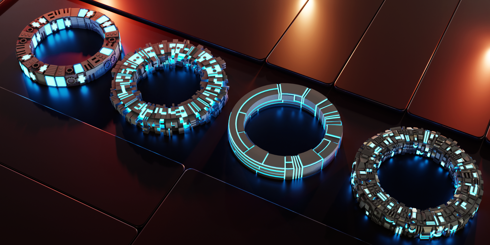
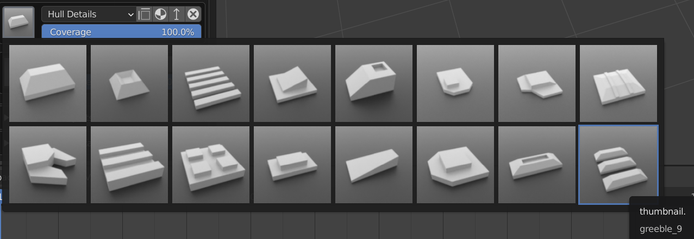
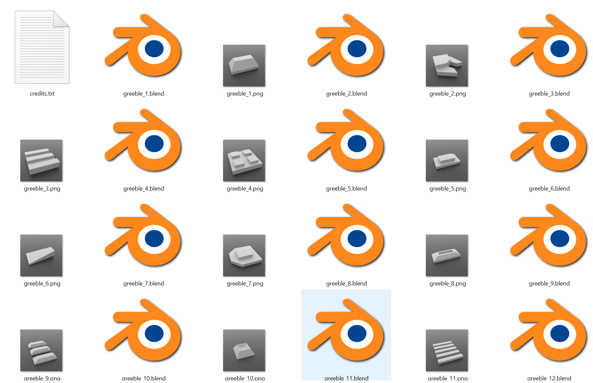

##########################
Greeble Libraries
##########################

|add_lib_video|

.. |add_lib_video| raw:: html

    <iframe width="560" height="315" src="https://www.youtube.com/embed/MT0buoHerHA" title="YouTube video player" frameborder="0" allow="accelerometer; autoplay; clipboard-write; encrypted-media; gyroscope; picture-in-picture" allowfullscreen></iframe>

You can create your own greeble libraries that can be loaded into Blender.

*********************************
Installing a Greeble Library
*********************************

#. Go to *Edit -> Preferences* and select the Add-Ons tab if it is not selected already:

    .. image:: ../images/greeble_lib_prefs.png
        :alt: Greeble Libraries Prefs

#. Then, find the Plating Generator add-on by starting to type *‘Plates…’* in the search box. Expanding the *‘Mesh: Generate Plates with Greebles’* entry should give you a small preferences screen:

    .. image:: ../images/greeble_lib_prefs2.png
        :alt: Greeble Libraries Prefs Expanded

#. There is a *‘Preferences’* section:

    .. image:: ../images/greeble_lib_prefs3.png
        :alt: Greeble Libraries Prefs Expanded

#. The Defaults are listed in their own directory.  If you delete all entries, clicking *‘Refresh Libraries’* will reset the directory list.

#. To add a new library, unzip the zip file to a separate folder somewhere on your computer. You should see a set of files with .blend and .png file pairs:

    .. image:: ../images/greeble_lib_add_folder.png
        :alt: Greeble Libraries Add folder

#. Now go to the preference screen and click the ‘Add Folder Containing Greebles’ button.  A new folder entry will appear:

    .. image:: ../images/greeble_lib_add_folder_btn.png
        :alt: Greeble Libraries Add folder

#. Finally, click ‘Refresh Greeble Libraries’ to load the greebles in:

    .. image:: ../images/greeble_lib_add_folder_refresh.png
        :alt: Greeble Libraries Refresh

You should now be able to use the new greebles library when using the add-on by selecting the library from the drop down list:

    Credit: |Sam Morse-Brown|

*********************************
Making a Greeble Library
*********************************

You can create your own greeble library by doing the following:

#. Create a folder for your greeble library. The name of the folder will be the name of the library.

#. Create a .blend file with the Greeble object in it. 

#. Greeble objects need to be a single blender object mesh, that is:

    * It does not have child objects and is all joined into one object.

    * All modifiers are applied.

    * It is a normal blender ‘Mesh’, not a curve, a light, or other object types.

    * It can optionally have Materials and UV Mapping.

#. **Make sure the object is called ‘Greeble’**. This is so the add-on can find the object when it looks in the file.

#. Create a thumbnail for the file by rendering a square picture of it in Blender and saving it as a .png in the same directory as the .blend file. It should also have the same name as the .blend file. For instance, if my greeble object is called **my_greeble** I would have a **my_greeble.blend** file and a square **my_greeble.png** file of, for instance, 500x500px in the one directory.

#. You can create as many .blend-.png pairs of files in the folder, and this will make up your greeble library.

A good way of seeing what a greeble folder should look like is by looking at the contents of the custom_greebles.zip example file.  There are example scenes that that you could copy:

    Credit: |Sam Morse-Brown|

.. |Sam Morse-Brown| raw:: html

   <a href="https://twitter.com/ParallelMayhem" target="_blank">Sam Morse-Brown</a>

If you have any issues do not hesitate to get in touch via `info@configurate.net <mailto:info@configurate.net>`_.