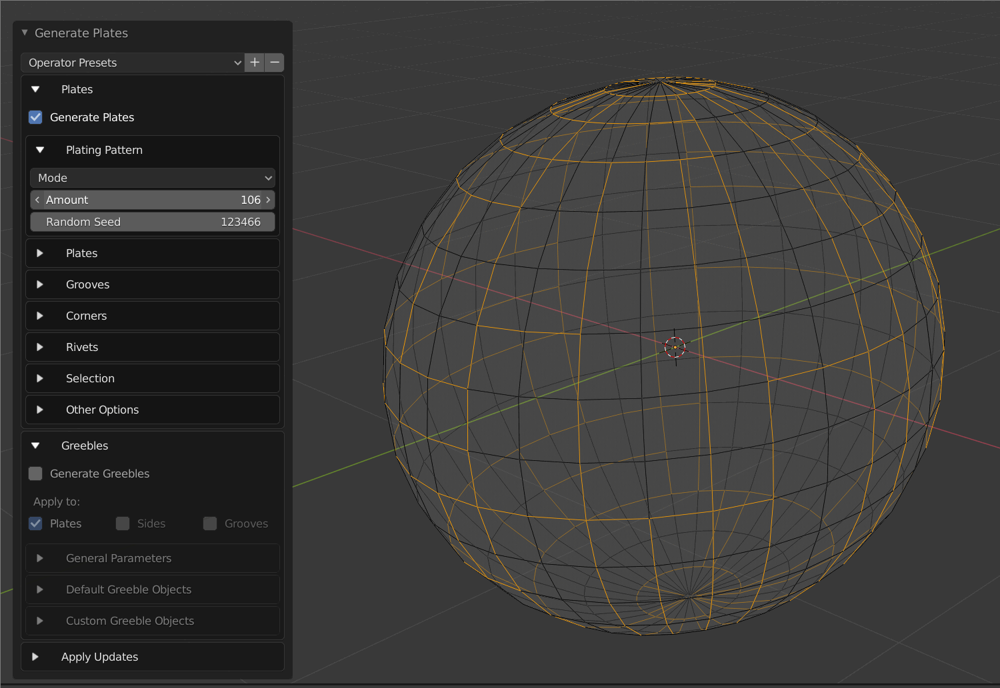

.. Plating Generator documentation master file, created by
   sphinx-quickstart on Mon Oct  4 20:18:37 2021.
   You can adapt this file completely to your liking, but it should at least
   contain the root `toctree` directive.

The Plating Generator
=============================================

V2.0: You (Can) Redo
---------------------------------

.. figure:: images/cross-ship.gif
  :alt: The Plating Generator at work

What is the Plating Generator?
---------------------------------

The |Plating Generator| creates customised, reconfigurable panel lines and |greeble| details on top of your 3D Model.  

This add-on is for 3D Modellers and concept artists who find it time consuming to create interlocking panels and details on 3D Models such as spaceship hulls, but still want a unique look and feel.  It uses specially designed algorithms to generate different patterns.

Features
---------------------------------

* Generate a panel lines or scatter smaller objects using a random seed.
* Use on flat or curves surfaces.
* Choose from a range of completely customizable plating patterns.
* Create your own |greeble| objects libraries or choose from the standard default library.
* The objects can either be created and edited separately or integrated into the base object.
* Go back and change the patterns and greebles from a fixed control panel at any time when they are created as separate objects.
* Create from a whole |quad| based mesh or on a sub selection of |quad| faces.
* Control the depth of the grooves, heights of the panels, thickness of the grooves, make corners rounded, and add bevel effects.
* Add your own materials and vary panel color through vertex colors.
* Greebles can either be overlapping or non-overlapping.
* Greebles can either conform to the shape of the face or maintain their proportions.
* Option to completely remove the grooves and leave the plates intact.

How does it work?
---------------------------------

For instance, a manual method is to extrude edge loops over and over, which can be very time consuming. The more detailed you want the mesh to be, the longer it will take:

  Manual Process Automated

This add-on greatly speeds up the process, allowing you to quickly create a selection in a plating pattern and and extrude the edges accordingly.

.. figure:: images/pg_in_action.gif
  :alt: Plating Generator in Action

  Plating Generator in Action

|Plating Generator| combined with the |Shape Generator| addon can quickly create detailed models which can then be further refined. It can also be used to create libraries of curated objects.

.. |Plating Generator| raw:: html

   <a href="https://blendermarket.com/products/plating-generator" target="_blank"><b>Plating Generator</b></a>

.. |Shape Generator| raw:: html

   <a href="https://blendermarket.com/products/shape-generator" target="_blank"><b>Shape Generator</b></a>

.. |greeble| raw:: html

   <a href="https://en.wikipedia.org/wiki/Greeble" target="_blank">greeble</a>

.. |quad| raw:: html

   <a href="https://www.google.com/search?q=what+are+quad+faces" target="_blank">quad</a>

.. toctree::
   :maxdepth: 2
   :caption: Contents:

   usage/installation
   usage/quickstart
   parameters/panel_controls
   parameters/levels
   parameters/properties
   selection/updating_selection
   usage/presets
   greeble_libraries/greeble_library
   anim_nodes/anim_nodes_overview
   iterator/iterator
   baking/baking
   contact/contact

Indices and tables
==================

* :ref:`genindex`
* :ref:`modindex`
* :ref:`search`

.. footer:: This is a test

 