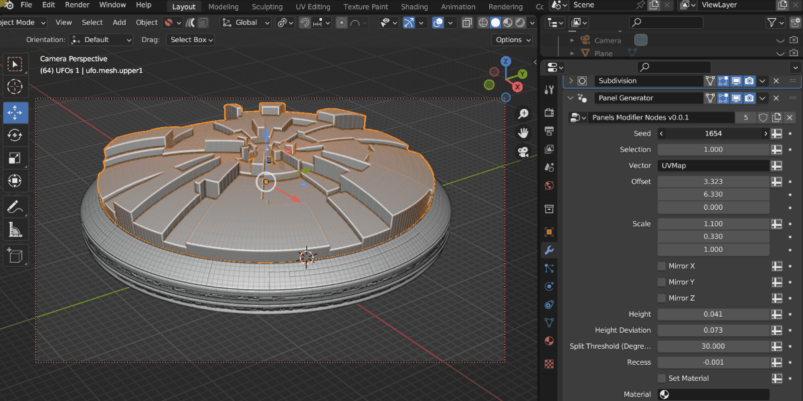
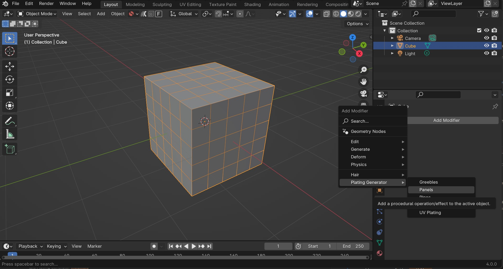
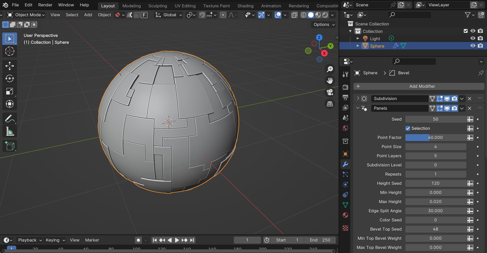
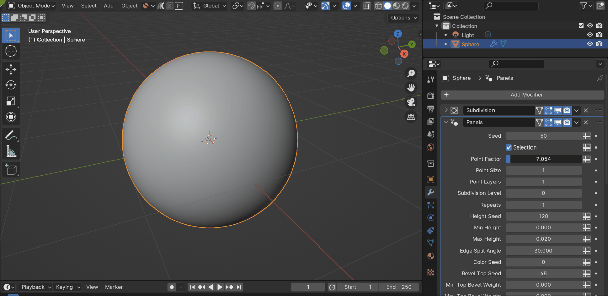
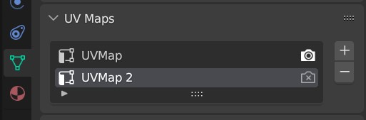

.. _modifiers:

######################
Modifiers and Tools
######################

.. warning::

    |Blender 4| only!

.. |Blender 4| raw:: html

   <a href="https://www.blender.org/download/" target="_blank"><b>Blender 4</b></a>

    Captured in realtime, the modifiers can out perform standard python code.

The Plating Generator comes with a set of Blender 4.0 Modifiers and Tools that add panelling effects and greebles on top of the base mesh in a non-destructive way. These are completely separate to the other Plating Generator workflows.

.. _adding-blender-asset-library:

********************************************************************
Installing the Assets
********************************************************************

    The modifiers are added as Assets in the Preferences menu.

The modifiers and tools are added as Blender Assets:

#. Locate the zip file **plating_generator_modifier_assets.unzip.me.zip** on your computer.
#. Right-click on the file and choose "Extract All" or a similar option. This will unzip the contents into a folder.
#. In Blender, go to ``Edit`` > ``Preferences`` in the top menu.
#. In the Preferences window, click on the "File Paths" section.
#. Within File Paths, find the "Asset Libraries" section.
#. Click the "+" button to create a new library entry.
#. A file browser will open. Navigate to where you extracted the zip file.
#. Select the folder that contains the assets.
#. Click "Add Asset Library".
#. In the Asset Libraries section, name your new asset library for easy identification.
#. Click the "Save Preferences" button to save your changes.
#. Restart Blender.

**********************************
Using the Modifiers and Tools
**********************************

========================================
Using the Modifiers
========================================

To add any one of the modifiers:

#. :ref:`Once the assets are installed<adding-blender-asset-library>`, select the object you wish to add a Modifier to.
#. Under the *Modifiers* side tab, access the Plating Generator modifiers by selecting the *Plating Generator* sub menu.

    .. figure:: ../images/adding_modifier.gif

        The Panelling modifier being added.  Note the cube has been subdivided to add faces the modifier can work with.

#. Once the modifier is added, you can use it like a regular Blender modifier.  See the :ref:`Modifiers and Tools list` below. Parameters are documented as tooltips on each of the individual inputs.

    .. image:: ../images/modifier_seed_change.gif

.. tip::

    .. figure:: ../images/modifier_bevel.gif
        :alt: Plating Generator modifiers

        A Bevel modifier can be added to highlight the Panelling effect.  
        
        If the Bevel modifier is set to **Weight** mode, any weight controls set in the Plating Generator modifier will be used.
        
========================================
Using the Tools
========================================

The same modifiers can be used as *Tools* when selecting faces in *Edit* mode:

#. :ref:`Once the assets are installed<adding-blender-asset-library>`, select the object and enter *Edit* mode by pressing the *tab* key.  Press 3 to enter *Face* mode, or click the small rectangular icon at the top of the viewport:

    .. image:: ../images/tools_edit_mode.jpg

#. Select some faces you wish to add an effect to:

    .. image:: ../images/tool_select_faces.jpg

#. Go to the *Face* menu at the top of the viewport and and select the *Plating Tools* sub-menu:

    .. image:: ../images/tools_rightclick_menu.jpg

#. Select one of the tools and expand the panel that appears in the bottom-right of the viewport.  This will be where you can control the parameters for each tool:

    .. image:: ../images/modifier_tool_demo.gif

.. warning:: Once the parameter menu is clicked away from, the tool will have finished.  If it was the last action you performed, try pressing the *F9* key to return to the menu.  Otherwise, a Blender tool is a one-time operation.

#. See the :ref:`Modifiers and Tools list` below for a list of the different modifiers/tools.

.. |UV Squares| raw:: html

   <a href="https://blendermarket.com/products/uv-squares?ref=361" target="_blank"><b>UV Squares</b></a>

.. |Follow Active Quads| raw:: html

   <a href="https://youtu.be/8nvgo266xG4" target="_blank"><b>Follow Active Quads</b></a>

.. |Object Data Properties| raw:: html

   <a href="https://docs.blender.org/manual/en/latest/modeling/meshes/properties/object_data.html" target="_blank"><b>Object Data Properties</b></a>

.. |Geometry Nodes| raw:: html
   
   <a href="https://docs.blender.org/manual/en/latest/modeling/geometry_nodes/introduction.html" target="_blank"><b>Geometry Nodes</b></a>

.. |Attributes| raw:: html

    <a href="https://docs.blender.org/manual/en/latest/modeling/geometry_nodes/attributes_reference.html" target="_blank"><b>Attributes</b></a>

**********************************
Modifiers and Tools list
**********************************

There are different modifiers and tools to choose from.  Parameters are documented as tooltips on each of the individual inputs:

============================
Panelling
============================

The default Panelling modifier, controlled by a random seed number. The *Point Factor* parameter randomly selects faces on the object, and then expands the selection based on the *Point Size*.

This effect is then repeated multiple times using the *Point Layers* parameter.  Then, this pattern is cutout to create the panelling effect.

This animation shows how the pattern is created so you can adjust it for different meshes:

============================
UV Panelling
============================

.. figure:: ../images/modifier_panelling.jpg
    :alt: Plating Generator modifiers

.. warning::

    :ref:`A UV Map is Required<Creating Grid shaped UV Maps>`

A base panelling effect that uses a combination of big, medium and small panels controlled by a UV Map and a random seed number. 

============================
UV Plating
============================

.. figure:: ../images/modifier_plating.jpg
    :alt: Plating Generator modifiers

.. warning::

    :ref:`A UV Map is Required<Creating Grid shaped UV Maps>`

A more customizable version of the UV Panelling modifier, allowing you to set materials and heights for different size panels.  Optional notches are added to the sides for greater detail.

============================
Greebles
============================

.. figure:: ../images/modifier_greebles.jpg
    :alt: Plating Generator modifiers

    The greebles modifier set to a density of 5000.

A modifier that adds random objects to the surface.  A default collection of objects is imported, which can be changed to a different collection on the modifier settings.

==============================
Pipes
==============================

.. figure:: ../images/modifier_pipes.jpg
    :alt: Plating Generator modifiers

A modifier that creates a simple random piping pattern.

.. tip::

    **Combining modifiers**

    .. figure:: ../images/modifier_combining1.jpg
        :alt: Plating Generator modifiers

    You can combine different modifiers together and use |Attributes| set by the modifiers to change where they are applied.  Here a Plating Modifier has been added first, and then a Greeble Modifier has then been added.  The *Selection* parameter has then been changed so the greebles only appear on the Small Panels.  
    
    This is by using the *Small Panels* attribute that has been set by the Plating modifier:

    .. figure:: ../images/modifier_combining.gif
        :alt: Plating Generator modifiers

**********************************
Using the Nodes
**********************************

Hidden behind each modifier is a set of node groups that can be used inside a Geometry Nodes set up.  These node groups can be loaded into a Blender scene and then used in combination with any other nodes.

To add the nodes for use:

#. :ref:`Once the assets are installed<adding-blender-asset-library>`, Go to the Geometry Nodes editing tab.

    .. figure:: ../images/geometry_nodes_tab.jpg
        :alt: Plating Generator modifiers

#. Add a Geometry Nodes modifier to the object if there is not one already.

    .. figure:: ../images/geometry_nodes_new_modifier.jpg
        :alt: Plating Generator modifiers

#. Click "New" to add a new Geometry Nodes tree to the modifier.

    .. figure:: ../images/geometry_nodes_new_node_tree.jpg
        :alt: Plating Generator modifiers

#. In the nodes editor view, press *shift-A* and search for one of the following modifier nodes:

    * **Panels Modifier Nodes**
    * **Plating Modifier Nodes**
    * **Greebles Modifier Nodes**

    .. figure:: ../images/geometry_nodes_search.jpg
        :alt: Plating Generator modifiers

    ...Any other nodes groups with similar names may be sub-node groups and are less useful.

#. You can then use the node in the same way as the modifier:

    .. figure:: ../images/geometry_nodes_example.jpg
        :alt: Plating Generator modifiers

    .. tip::

        * Remember to add a UV Map when needed (e.g. from a Named Attribute node - see screenshot) to the *Vector* input to supply a UV Map to the node.  Otherwise, nothing will be displayed.
        * Also make sure the mesh has enough face subdivisions to see a result (as seen in the screenshot)
        * Adjust parameters (e.g. height) on the node to check it is working.

*******************************************************************
Creating Grid shaped UV Maps
*******************************************************************

Some of the panel modifiers specifically require a grid shaped UV Map for them to work, otherwise nothing will be displayed.  You can use the |UV Squares| add-on to achieve this or by using the |Follow Active Quads| method.  Remember, you can add more than one UV Map to an object in Blender's |Object Data Properties| tab if you already have a UV Map you wish to keep.

.. figure:: ../images/modifiers_uv_map_required.jpg
    :alt: Plating Generator modifiers

    The ideal UV Map is made up of a square grid for the pattern to work well.  Here, the |UV Squares| add-on is used to make the UV faces square.

    Remember you can create more than one UV map under the Object Data Properties tab.

********************************************************************
Having issues with the modifiers or nodes?
********************************************************************

Don't hesitate to :ref:`Get in touch<contact>`
