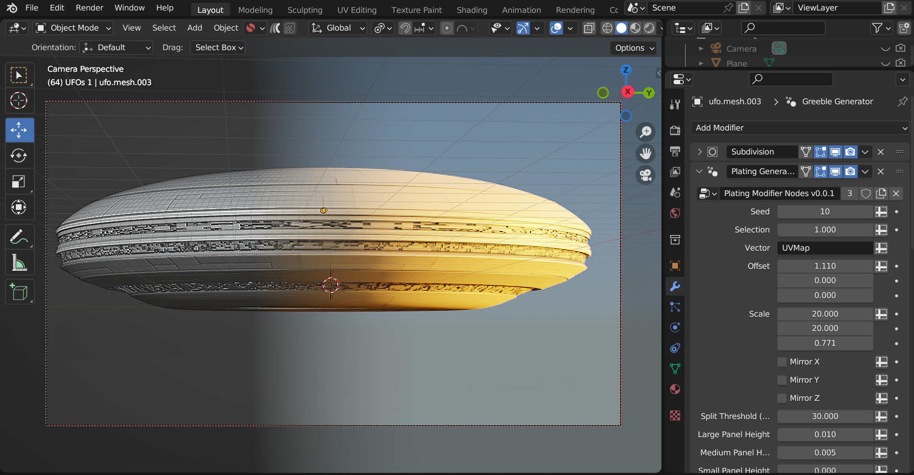
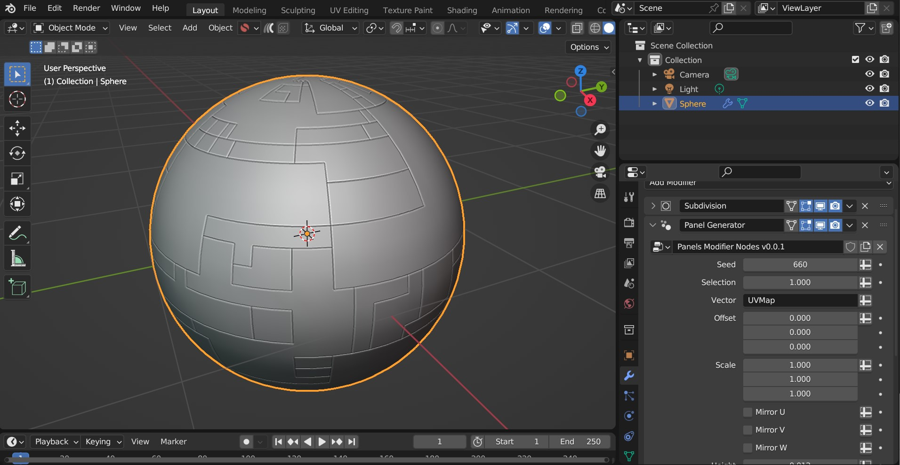
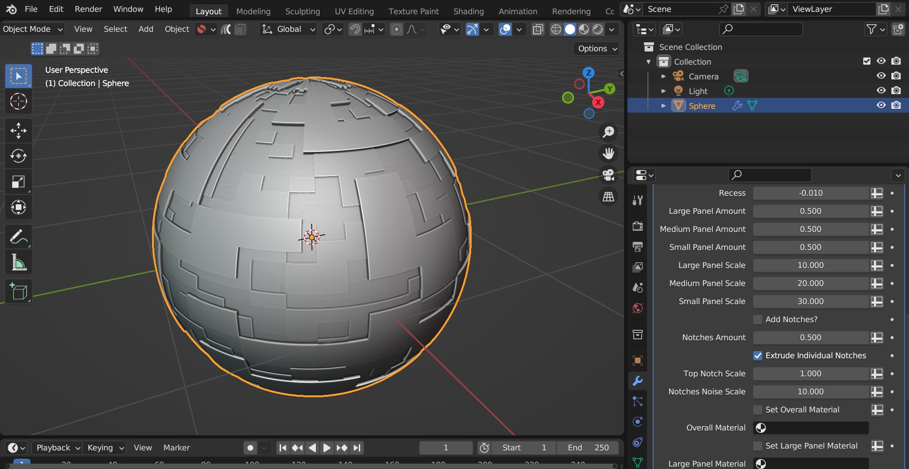
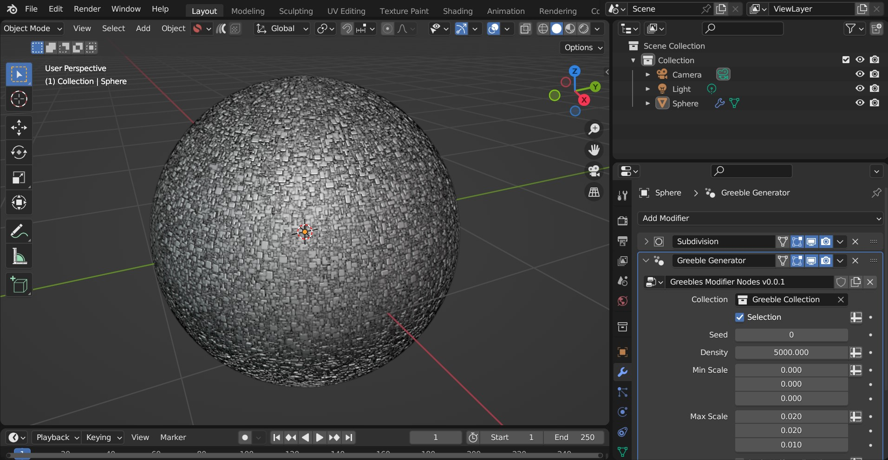
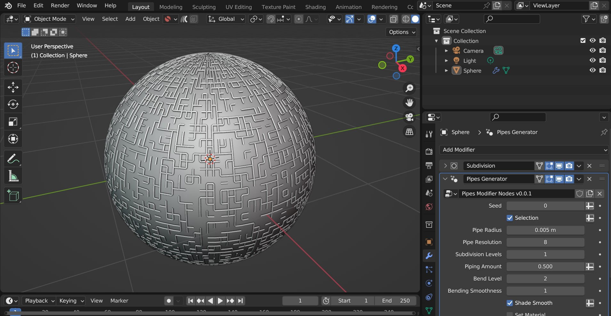

######################
Modifiers
######################

The Plating Generator comes with a set of modifiers that add panelling effects and greebles on top of the base mesh, also in a non-destructive way.

* These are completely separate to the other Plating Generator workflows.
* They require a grid shaped UV Map to work.
* The modifiers use, but do not require knowledge of, |Geometry Nodes|.  However by learning a little |Geometry Nodes| you will get the most out of them.

.. tip::

    **Advantages**

    * **Fast**: As the modifiers use Blender's core processes, they are a lot faster than the standard Python add-on functions.  They will also work on meshes with larger numbers of faces.

        .. figure:: ../images/modifiers_speed.gif
            :alt: Plating Generator modifiers

            Captured in realtime, the modifier can out perform standard python.

    * **Flexible**: As they are modifiers that use Geometry Nodes, you can use them with Blender's other modifiers or use them as a node with other Geometry Nodes.
    * **Non-destructive**: The modifiers do not alter the base mesh and will update automatically when the base mesh changes.
    * **Animatable**: The parameters of the modifiers can be animated using keyframes.

    **Disadvantages**

    * **UV Map Required**: The panel modifiers specifically require a grid shaped UV Map for them to work, otherwise nothing will be displayed.  You can use the |UV Squares| add-on to achieve this or by using the |Follow Active Quads| method.  Remember, you can add more than one UV Map to an object in Blender's |Object Data Properties| tab if you already have a UV Map you wish to keep.

        .. figure:: ../images/modifiers_uv_map_required.jpg
            :alt: Plating Generator modifiers

            The ideal UV Map is made up of a square grid for the pattern to work well.  Here, the |UV Squares| add-on is used to make the UV faces square.

        .. figure:: ../images/uv_data_properties.jpg
            :alt: Plating Generator modifiers

            Remember you can create more than one UV map under the Object Data Properties tab.

    * **Quad topology ideal**: Ideally the geometry should be arranged in quad topology.
    * **Limited features**: As Geometry nodes is still evolving, the modifier parameters are comparatively limited compared to the other Plating Generator workflows.

   
**********************************
Using the Modifiers
**********************************

Add any one of the modifiers by:

#. Selecting the object you wish to add one of the modifiers to.  The object requires a square shaped UV map and a set of faces to extrude.

.. tip::

    * You could use a Subdivision Surface modifier (optionally set to *Simple*) to increase geometry for the modifier.
    * You can use selections of faces with the modifier, but it is recommended to separate geometry for different effects.

#. Right-click in the viewport and go to the *Plating Generator* section of the context menu.  There should be a *Modifiers* section that lists all current Plating Generator modifiers:

    .. figure:: ../images/modifiers_context_menu.jpg
        :alt: Plating Generator modifiers

#. Select the modifier you wish to add from the *Modifiers* section of the menu.
#. The modifier will be added to the object, along with any additional modifiers (e.g. a bevel modifier) that complements the effect.  You may wish to adjust parameters like the heights of the panels to make sure the effect is working.

    .. figure:: ../images/modifier_added.gif
        :alt: Plating Generator modifiers

    .. tip::

        .. figure:: ../images/modifier_bevel.gif
            :alt: Plating Generator modifiers

            A Bevel modifier might be added to highlight the Panelling effect.  You can adjust this separately to the main modifier.
        

.. |UV Squares| raw:: html

   <a href="https://blendermarket.com/products/uv-squares?ref=361" target="_blank"><b>UV Squares</b></a>

.. |Follow Active Quads| raw:: html

   <a href="https://youtu.be/8nvgo266xG4" target="_blank"><b>Follow Active Quads</b></a>

.. |Object Data Properties| raw:: html

   <a href="https://docs.blender.org/manual/en/latest/modeling/meshes/properties/object_data.html" target="_blank"><b>Object Data Properties</b></a>

.. |Geometry Nodes| raw:: html
   
   <a href="https://docs.blender.org/manual/en/latest/modeling/geometry_nodes/introduction.html" target="_blank"><b>Geometry Nodes</b></a>

.. |Attributes| raw:: html

    <a href="https://docs.blender.org/manual/en/latest/modeling/geometry_nodes/attributes_reference.html" target="_blank"><b>Attributes</b></a>

**********************************
Modifiers list
**********************************

There are different modifiers to choose from.  Parameters are documented as tooltips on each of the individual inputs:

============================
Panelling Modifier
============================

A base panelling effect that uses a combination of big, medium and small panels controlled by a random seed number.

============================
Plating Modifier
============================

A more customizable version of the panelling modifier, allowing you to set materials and heights for different size panels.  Optional notches are added to the sides for greater detail.

============================
Greebles Modifier
============================

    The greebles modifier set to a density of 5000.

A modifier that adds random objects to the surface.  A default collection of objects is imported, which can be changed to a different collection on the modifier settings.

==============================
Pipes Modifier
==============================

A modifier that creates a simple random piping pattern.

.. tip::

    **Combining modifiers**

    .. figure:: ../images/modifier_combining1.jpg
        :alt: Plating Generator modifiers

    You can combine different modifiers together and use |Attributes| set by the modifiers to change where they are applied.  Here a Plating Modifier has been added first, and then a Greeble Modifier has then been added.  The *Selection* parameter has then been changed so the greebles only appear on the Small Panels.  
    
    This is by using the *Small Panels* attribute that has been set by the Plating modifier:

    .. figure:: ../images/modifier_combining.gif
        :alt: Plating Generator modifiers

**********************************
Using the Nodes
**********************************

Hidden behind each modifier is a set of node groups that can be used inside a Geometry Nodes set up.  These node groups can be loaded into a Blender scene and then used in combination with any other nodes.

To add the nodes for use:

#. Go to the Geometry Nodes editing tab.

    .. figure:: ../images/geometry_nodes_tab.jpg
        :alt: Plating Generator modifiers

#. Add a Geometry Nodes modifier to the object if there is not one already.

    .. figure:: ../images/geometry_nodes_new_modifier.jpg
        :alt: Plating Generator modifiers

#. Click "New" to add a new Geometry Nodes tree to the modifier.

    .. figure:: ../images/geometry_nodes_new_node_tree.jpg
        :alt: Plating Generator modifiers

#. In the nodes editor view, right-click and select "Import Plating Generator Geometry Node Groups". This will import all node groups if they have not been added already.

    .. figure:: ../images/geometry_nodes_import_node_group.jpg
        :alt: Plating Generator modifiers

#. In the nodes editor view, press *shift-A* and search for one of the following modifier nodes:

    * **Panels Modifier Nodes**
    * **Plating Modifier Nodes**
    * **Greebles Modifier Nodes**

    .. figure:: ../images/geometry_nodes_search.jpg
        :alt: Plating Generator modifiers

    ...Any other nodes groups with similar names may be sub-node groups and are less useful.

#. You can then use the node in the same way as the modifier:

    .. figure:: ../images/geometry_nodes_example.jpg
        :alt: Plating Generator modifiers

    .. tip::

        * Remember to add a UV Map (e.g. from a Named Attribute node - see screenshot) to the *Vector* input to supply a UV Map to the node.  Otherwise, nothing will be displayed.
        * Also make sure the mesh has enough face subdivisions to see a result (as seen in the screenshot)
        * Adjust parameters (e.g. height) on the node to check it is working.

********************************************************************
Having issues with the modifiers or nodes?
********************************************************************

Don't hesitate to :ref:`Get in touch<contact>`
