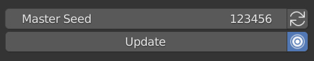

##############
Control Panel
##############

When using a  :ref:`Non Destructive Workflow`, if you select a *plating* object the *Plating Generator Panel* will show the parameters for the object.  This panel is on the right hand side of the viewport.  If this is not visible, press the *n* key in the viewport to display Blender's properties panel, and select the *Plating Generator* side tab:

.. figure:: ../images/control_panel_intro.jpg
    :alt: Main Control Panel

    The Plating Generator Properties Panel

*****************
Main Controls
*****************

    Main Control Panel

These control the overall randomisation for the Plating Generator and whether to automatically update the object when parameters are changed:

    .. figure:: ../images/master_seed.jpg
        :alt: Master Seed

        The Master Seed Controls the randomisation of **all** the Generator code and will change what the *Plating* object looks like within the parameters of the add-on.
        
    .. figure:: ../images/refresh_master_seed.jpg
        :alt: Refresh Master Seed

        This button will change the *master seed* parameter at random so you can quickly try out different variations.

    .. figure:: ../images/update_btn.jpg
        :alt: Main Control Panel

        This button will update the object with the parameters specified in the panel.

    .. figure:: ../images/auto_update_btn.jpg
        :alt: Main Control Panel

        When turned on, any parameter changed in the Plating Generator panel will automatically update the object.  If switched off, you will need to manually press the **Update** button to update the selected object.

.. figure:: ../images/main_controls.gif
    :alt: Main Control Panel

    Auto Update on while randomly changing the main seed.

