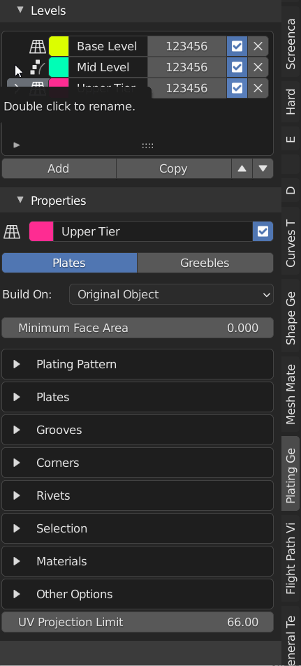

###########
Parameters
###########

*********************
Parameters Panel
*********************

When you click a level, it gets selected and the associated parameters appear in the *Properties* panel below it:

    Selecting different levels to access different properties

TODO PRESETS
TODO Updating selection