######################
Greeble Properties
######################

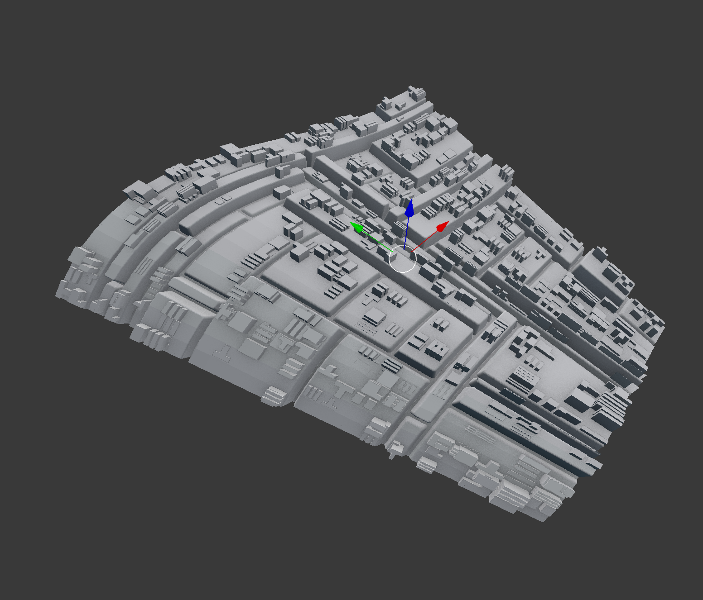

The Greeble objects are aligned randomly onto quad faces. The overall shape of each greeble is deformed to follow the face it is being placed on unless the **Maintain Aspect Ratio** property is checked.

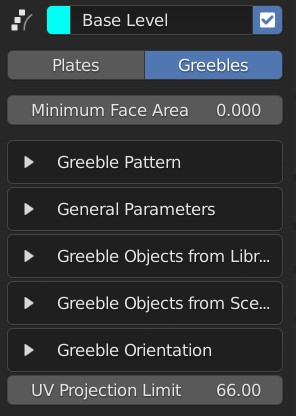

    Main properties panel for adding greebles.

**********************************
General Properties: Greebles
**********************************

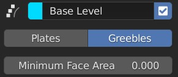

    Greeble General Properties

* **Level Color**: Color to denote level for organisational purposes.  Has no direct effect on object.
* **Level Name**: The name of the :ref:`Level<Levels>` for these properties.
* **Enabled Checkbox**: Whether the :ref:`Level<Levels>` is activated or not.
* **Plates/Greebles**: Whether we are creating Plates or Greebles.

**********************************
Greeble Pattern
**********************************

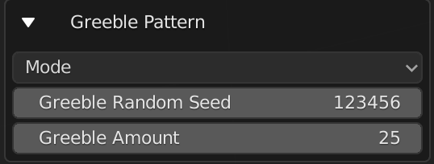

* **Mode**: This has the following options:
  
  * **Overlapping**: The greeble objects are randomly placed on a face and can overlap.

        .. image:: ../../images/prop_overlapping.png
            :alt: Overlapping

  * **Non-Overlapping**: The greeble objects are placed so that they do not overlap.

        .. image:: ../../images/prop_nonoverlapping.png
            :alt: Non Overlapping

Each mode has different parameters because each uses a different approach to placing the objects:

Overlapping
=============

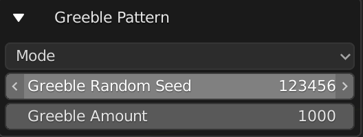

* **Greeble Random Seed**: by changing this value, you will create different random patterns.
* **Greeble Amount**: The number of greeble objects to be put on the object.

Non-Overlapping
==========================

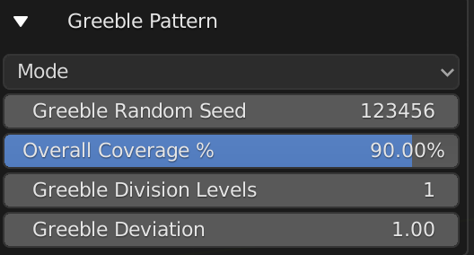

* **Greeble Random Seed**: by changing this value, you will create different random patterns.
* **Overall Coverage %**: The percentage covering the object.
* **Greeble Division Levels**: Each face will be allocated spaces for the greebles.  Higher levels means more objects will be fit onto each face. The user interface is restricted but you can enter higher values.
* **Greeble Deviation**: This is how much each greeble's size varies on a face. A value of 0 will create a uniform set of sizes, where a value of 1.0 will create irregular sizes.

*****************************
Greeble General Parameters
*****************************

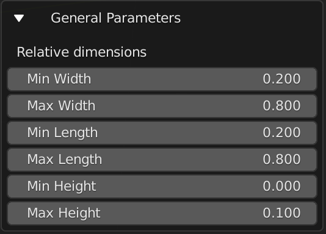

* **Min Width**: The minimum width of a greeble object relative to the face it is on.
* **Max Width**: The maximum width of a greeble object relative to the face it is on.
* **Min Length**: The minimum length of a greeble object relative to the face it is on.
* **Max Length**: The maximum length of a greeble object relative to the face it is on.
* **Min Height**: The minimum height of a greeble object relative to the face it is on.
* **Max Height**: The maximum height of a greeble object relative to the face it is on.

*********************************
Greeble Objects from Library
*********************************

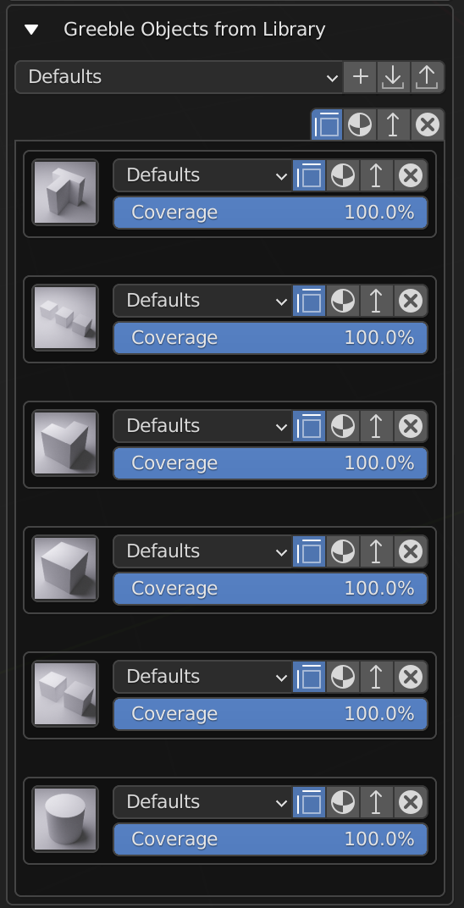

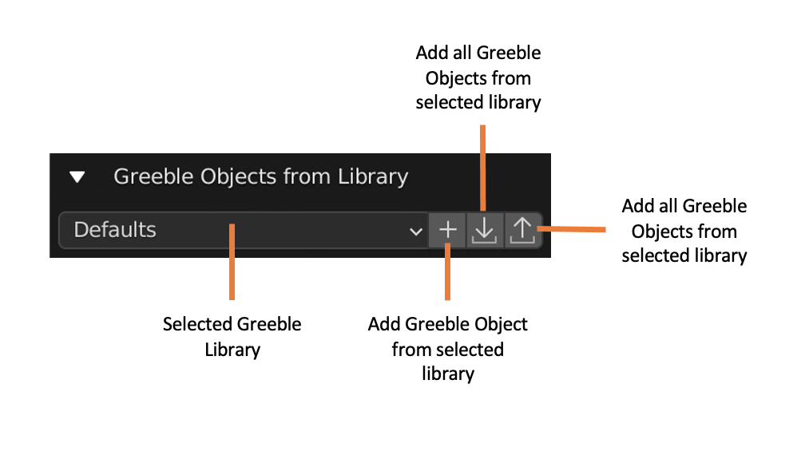

There are several basic objects supplied as a default greeble library to create Greeble effects from.  You can choose to add squares in different patterns, L shapes, T shapes, or cylinders.  

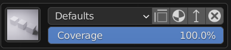

There are settings for each object and by hovering the mouse you should see a description for each one. They are:

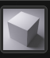

* **A thumbnail of the greeble**:. Clicking on this thumbnail shows you which other objects you can choose from within that greeble library.

* **A drop down menu** showing which greeble library the object comes from. If you have other greeble libraries installed, you can select them here.

* **Maintain Aspect Ratio**: This will keep the proportions of the object's width and height in case you do not want the object stretched.

* **Material Index**: Override the material on the greeble with a material index slot.  By default, these objects will inherit the material of the object. Values of -1 will not override the material.

    .. image:: ../../images/prop_greeble_mat_id_expanded.png
        :alt: Material Index Expanded

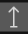

* **Height Override**: This will automatically override the height of each greeble so that you can stop shapes stretching unnecessarily.

    .. image:: ../../images/prop_greelbe_height_override_expanded.png
        :alt: Height Override Expanded

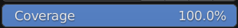

* **Coverage:** This controls the amount this Greeble will cover the surface relative to the total number of greebles set under the ‘Greeble Pattern’ section. This allows you to adjust the relative amount of each object on the total number of greeble objects.  For instance, if you have 50% L shapes and 100% T shapes, the effect will roughly have half as many L shapes as T shapes.

These parameters also apply to :ref:`Greeble Objects from Scene`.

*********************************
Greeble Objects From Scene
*********************************

The add-on allows you to add your own greebles from scene objects. 

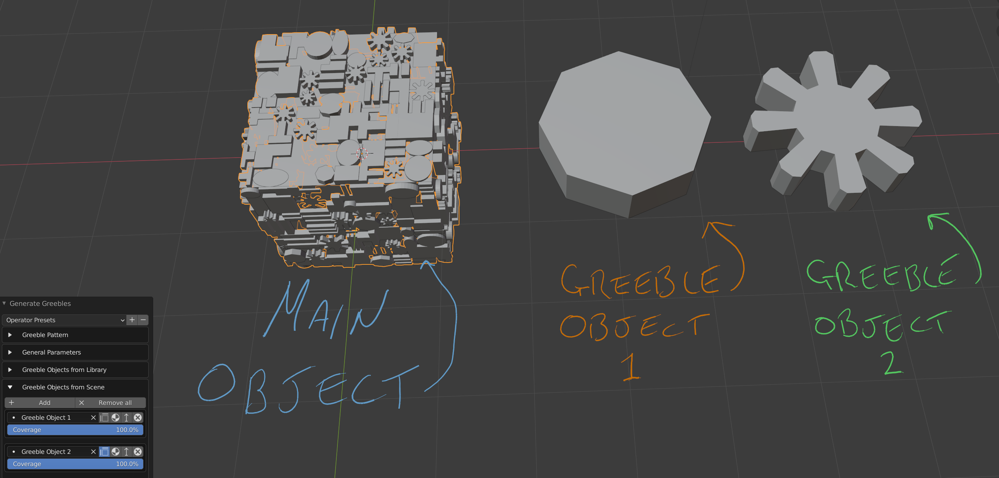

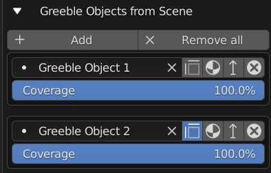

By clicking "**Add**" you will be able to select the scene object.  Once selected, the objects will be added as Greebles.  You can adjust the coverage and other parameters of these objects just like the :ref:`library greebles<Greeble Objects from Library>`. 

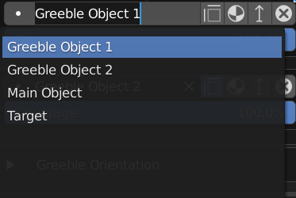

The objects will be added to a face relative to the same direction as the z-axis of the original object.

*********************************
Greeble Orientation
*********************************

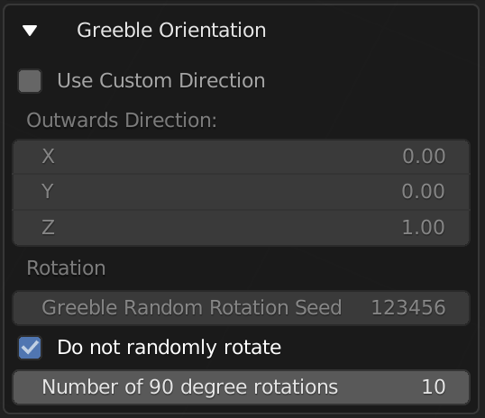

This section allows you to point the greebles in a customized direction and to control the random rotation of the greebles.

* **Use Custom Direction**: By default, the greebles point out from the Mesh along the normal of the faces they are on. This option allows you to point the greebles in a custom direction along the vector defined under *Outwards Direction*. A value of (0,0,1), for instance, will point all Greebles in the Z direction:

    .. figure:: ../../images/prop_greeble_follow_normals.png
        :alt: Greeble Orientation: Follow Normals

        **Default**: Greebles follow the face normals.
    
    .. figure:: ../../images/prop_greeble_follow_normals.png
        :alt: Greeble Orientation: Follow Normals

        **Custom Direction**: All greebles point in the same customisable direction.

* **Rotation**: The greebles are randomly rotated in 90 degree turns when they are placed on the mesh.  You can control or disable this function:
  
    * **Greeble Random Rotation Seed**: this will change the random pattern of greeble rotations without affecting their overall positions.

    * **Do not randomly rotate**: This disables random rotation, and allows you to specify the number of 90 degree turns by changing **Number of 90 degree rotations**.