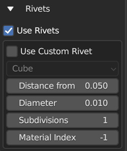

######################
Plating Properties
######################

.. figure:: ../../images/properties_panel_plates.jpg
    :alt: Main Control Panel

    Main properties panel for the plating effect.

**********************************
General Properties: Plates
**********************************

.. figure:: ../../images/plating_level_props.jpg
    :alt: Main Control Panel

    Plating General Properties

* **Level Color**: Color to denote level for organisational purposes.  Has no direct effect on object.
* **Level Name**: The name of the :ref:`Level<Levels>` for these properties.
* **Enabled Checkbox**: Whether the :ref:`Level<Levels>` is activated or not.
* **Plates/Greebles**: Whether we are creating Plates or Greebles.

**********************************
Plating Pattern
**********************************

Configure how the plating pattern is created.

Pattern Types
==================

.. image:: ../../images/pattern_type.jpg
    :alt: Pattern Type Option

Choose between different patterns to create the panelled effect.  Each has it's own set of options:

Criss Cross
-----------

Create intersecting edge loops. The following options apply:
  
    * **Random Seed**: generate a different selection based on the whole number given here.

    * **Amount**: the percentage of plate cuts generated.

    * **Subdivisions**: this will subdivide the selected faces before applying the pattern. 
  
        .. image:: ../../images/pattern_subdivisions.gif
            :alt: Subdivisions at work

Ruby Dragon
-----------

Randomly select faces by walking around the mesh. The following options apply:

    * **Random Seed**: generate a different selection based on the whole number given here.

    * **Percentage**: The percentage of grooves to add.

    * **Subdivisions**: this will subdivide the selected faces before applying the pattern. 

Triangular
----------------------

    .. image:: ../../images/pattern_triangular.jpg  
        :alt: Triangular Pattern

Similar to Criss-Cross, with added triangular accents added randomly to the grooves. Additional properties:

    * **Triangles Random Seed**: Change where triangular parts of the grooves are added independent to the main random seed.

    * **Amount of triangles**: As a percentage, how many triangles are added to the standard pattern.

    * **Subdivisions**: this will subdivide the selected faces before applying the pattern. 

Rectangles
----------------------

    .. image:: ../../images/pattern_rectangles.jpg  
        :alt: Morse Brown Pattern

Create sets of rectangles of varying sizes on the object.  This is a more experimental version where some lines may not intersect, but changing the seed may remove these results.

    * **Rectangle Random Seed**: Change where rectangles are added independent to the main random seed.

    * **Rectangle Amount**: Number of rectangles to cut out.
  
    * **Rectangle Width Min**: Minimum number of width edges for rectangles.

    * **Rectangle Width Max**: Maximum number of width edges for rectangles.

    * **Rectangle Height Min**: Minimum number of height edges for rectangles.

    * **Rectangle Height Max**: Maximum number of height edges for rectangles.

    * **Subdivisions**: this will subdivide the selected faces before applying the pattern. 

Morse Brown
----------------------

    .. image:: ../../images/pattern_morse-brown.jpg  
        :alt: Morse Brown Pattern

Inspired by |Sam Morse-Brown|, this is a combination of the criss-cross pattern combined with rectangle shapes and triangles.  This is a more experimental version where some lines may not intersect, but changing the seed may remove these results.

    * **Rectangle Random Seed**: Change where rectangles are added independent to the main random seed.

    * **Rectangle Amount**: Number of rectangles to cut out.
  
    * **Rectangle Width Min**: Minimum number of width edges for rectangles.

    * **Rectangle Width Max**: Maximum number of width edges for rectangles.

    * **Rectangle Height Min**: Minimum number of height edges for rectangles.

    * **Rectangle Height Max**: Maximum number of height edges for rectangles.

    * **Slices Random Seed**: The number of edge loops to create on the pattern.  If they intersect with a rectangle, they will be terminated.

    * **Slices Amount**: Number of slices to make in the pattern.

    * **Triangles Random Seed**: Change where triangular parts of the slices are added independent to the main random seed.

    * **Amount of triangles in slice**: As a percentage, how many triangles are added to the sliced pattern.

    * **Subdivisions**: this will subdivide the selected faces before applying the pattern. 

.. |Sam Morse-Brown| raw:: html

   <a href="https://twitter.com/ParallelMayhem" target="_blank">Sam Morse-Brown</a>

Selected Edges
----------------------

.. image:: ../../images/pattern_selected_edges.jpg  
    :alt: Selected Edges Pattern
  
Use the edges that have been already selected.  For this mode to work, select edges in Edge Edit mode instead.  

Add Grooves by Face Angle
-----------------------------

.. image:: ../../images/prop_face_angle.jpg  
    :alt: Face Angle Property

When activated, this will also add grooves wherever the edge of two faces match that angle.

* **Edge Angle**: The angle where grooves will be added.

* **+/-**: How much deviation around the angle to match edges by. 

**********************************
Plates
**********************************

.. image:: ../../images/prop_plates.jpg
    :alt: Plates Properties

Configure how the plates are created.

Plate Taper
==================

* **Amount**: This will shrink the tops of the plates.  By increasing the amount, the plates should become smaller.  You can also use negative amounts to make the plate tops larger.

Plate Heights
==================

.. image:: ../../images/prop_match_heights.jpg
    :alt: Heights Properties

These options will vary the heights of each plate at random, which should allow you to create more varied effects:

* **Match Heights**: Keep the Min and Max Height properties the same.
* **Min Height**: The minimum height of plates\*
* **Max Height**: The maximum height of the plates\*
* **Random Seed**: This will vary the random pattern that the heights are set at, without changing the plating pattern.

\* note that the Min Height can be higher than the Max Height!

Plate Bevel
==================

.. image:: ../../images/plate_bevel2.jpg
    :alt: Plates Bevel
    :width: 50%

Add a bevel effect around the plates:

* **Amount**: How bevelled are the top of the plates.
* **Segments**: How many segments the plate bevel has.
* **Plate Bevel Type**: The type of Bevel to apply. See the |bevel documentation|.

*****************************
Grooves
*****************************

This section controls the grooves between the plates.

* **Clamp Groove Width**: prevent the grooves from overlapping geometry.
* **Width**: the width of the grooves between the plates.
* **Depth**: The depth of the grooves between the plates.
* **Groove Segments**: Number of segments inside the grooves.
* **Side Segments**: Number of segments on the side of the plates.

Groove Bevel
========================

Add a bevel effect around the grooves:

* **Amount**: How bevelled are the groove edges between the plates.
* **Segments**: How many segments the groove bevel has.
* **Groove Bevel Type**: The type of Bevel to apply. See the |bevel documentation|.

*****************************
Corners
*****************************

For the corners of the plates, you can also add a curved bevel to give rounded corners.

.. image:: ../../images/prop_corners.jpg
    :alt: Corners Properties

* **Match Corners**: when checked, both the *Major* and *Minor* corners will be kept the same.

Major Corners
========================

Major corners are the surrounding corners of the original face selection:

.. image:: ../../images/prop_major_corners.gif
    :alt: Major Corners Anim

* **Amount**: bevel width of the corners.
* **Segments**: the number of segments in the bevel.
* **Major Corner Bevel Type**: The type of Bevel to apply. See the |bevel documentation|.

Minor Corners
========================

Control the opposite to major corners:

* **Amount**: bevel width of the corners.
* **Segments**: the number of segments in the bevel.
* **Minor Corner Bevel Type**: The type of Bevel to apply. See the |bevel documentation|.

.. |bevel documentation| raw:: html

   <a href="https://docs.blender.org/manual/en/dev/modeling/meshes/editing/subdividing/bevel.html" target="_blank">bevel documentation</a>

*****************************
Rivets
*****************************

You can add spherical rivets to the corners of the plates.  The shapes are standard ico spheres.

.. image:: ../../images/prop_rivets_pic.png
    :alt: Rivets
    :width: 50%

* **Use Rivets**: whether to add rivets or not.
* **Distance from Corner** this will determine the distance of the rivets from the corners.

    .. image:: ../../images/prop_rivets_dist_corner.gif
        :alt: Rivets Distance from Corner

* **Diameter**: diameter of the spherical rivets.
* **Subdivisions**: level of detail for the rivets.
* **Material Index**: the index of the material slot to use for the rivets.  -1 will disable assigning a material.

*****************************
Materials
*****************************

Add custom materials to the plating panels.  

By default, the plates will be created with the same materials as the selected faces. The following parameters let you override that behavior with materials you have defined:

Groove Material
=========================

Specify a material for the grooves via a drop-down box that shows you existing materials.

.. warning::
   In the :ref:`Non Destructive Workflow` the grooves are removed by default, so you may not see the effect.  Uncheck the :ref:`Remove Inner Grooves<Other Options>` property to see them.

Plating Materials
===========================

.. figure:: ../../images/prop_plating_mats.png
    :alt: Plating Material Properties

    Plating effect with different materials applied to each set of plates.

This section allows you to specify different materials to randomly applied to each plate.  A plate is a group of faces between the grooves.

It has the following parameters:

* **No. of Plating Materials**: The number of different materials to be randomly applied to the plates.  Increasing this number will create new material drop-down boxes for you to populate\*:

    .. figure:: ../../images/prop_plating_mat2.png
        :alt: Plating Material Properties

    \* There is a known bug in Blender where by pressing the 'X' the menu will disappear in the :ref:`Destructive Workflow`.  Use the number of plating materials parameter to control the number of materials instead.

* **Add Vertex Colors**: Add a vertex color group called plating_color to the plates.  A random color value is assigned per plate. 
* **Vertex Color Random Seed**: You can change these random colors by altering thia value. You can then use this in a material shader to control the color of a material: 
  
    .. figure:: ../../images/prop_plating_mat_vertex_cs.gif
        :alt: Vertex Color Properties

        Different seed values being applied to the vertex color layer.

    .. figure:: ../../images/vertex_color_mat_example.png
        :alt: Vertex Color Example Material

        Simple example of a vertex color layer controlling a material.

*****************************
Other Options
*****************************

.. image:: ../../images/prop_other_options.jpg
    :alt: other Options

* **Select Groove Geometry**: select the created groove faces.
* **Select Plate Geometry**: select the created faces for the plates.
* **Mark UV Seams**: mark UV Seams around the plates for texture mapping purposes.
* **Edge Split**: this will split the groove edges to make sure the outer plates remain smooth.
* **Remove Grooves**: completely remove the grooves and just leave the plates. Useful with Solidify modifier.
* **Remove Inner Grooves**: This allows you to remove just the inner groove faces.  Useful in the :ref:`Non Destructive Workflow` when you just want the plates and sides.
* **Edge Selection Only**: only select the edges, without the mesh being edited.  Useful if you want to perform custom operations on the selection.
* **Shade Smooth**: All faces will have their shading set to *smooth*.

*****************************
UV Projection
*****************************

.. image:: ../../images/prop_UV_limit.jpg
    :alt: UV Projection on Plates

The Plates will automatically have Blender's |UV Smart Projection| algorithm applied to generate UVs for texturing. 

* **UV Projection Limit**: This controls how faces are grouped: a higher limit will lead to many small groups but less distortion, while a lower limit will create fewer groups at the expense of more distortion.

.. image:: ../../images/prop_UV_projection.jpg
    :alt: UV Projection on Plates

.. |UV Smart Projection| raw:: html

   <a href="https://docs.blender.org/manual/en/2.79/editors/uv_image/uv/editing/unwrapping/mapping_types.html#smart-uv-project" target="_blank">UV Smart Projection</a>

*****************************
Smoothing
*****************************

.. image:: ../../images/prop_auto_smooth.jpg
    :alt: UV Projection on Plates

When checked, the whole object will have |auto smoothing| applied and is controlled by the **Auto Smooth Angle**.

.. |auto smoothing| raw:: html

   <a href="https://docs.blender.org/manual/en/2.79/modeling/meshes/editing/normals.html#auto-smooth" target="_blank">auto smoothing</a>
