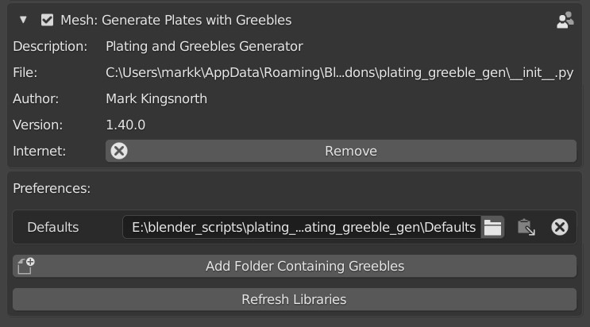
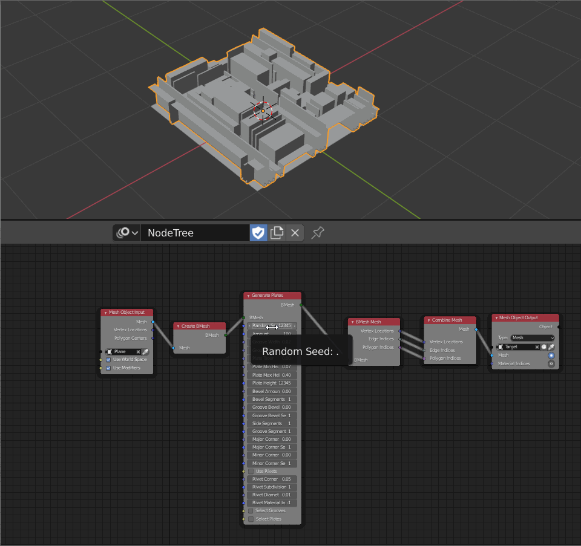
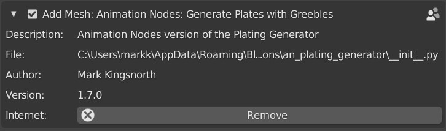

#############
Installation
#############

You will be provided with the following files:

* For Blender installation (*do not unzip*, install via Blender UI):
  
  * **plating_generator_greebles.zip** - the main add-on file.
  * **animation_nodes_plating_generator.zip** - an optional extension add-on for animation nodes.

* Libraries and samples (*do unzip*!):
  
  * **greeble_libraries.zip** - a bonus set of greeble libraries.
  * **animation_nodes_samples.zip** - A set of sample.blend files demonstrating the animation node setup.

Instructions for how to install the add-on and additional features are below.

The general order of installation is:

#. Install :ref:`Main Add-on<Main Add-on>` file (e.g. plating_generator_greebles.zip)
#. Install |Animation Nodes|. \* 
#. Install Animation Nodes Version add-on (e.g. animation_nodes_plating_generator.zip). \* 

\* *These are optional steps and not essential to use the core add-on.*

.. |Animation Nodes| raw:: html

   <a href="https://https://animation-nodes.com/" target="_blank">Animation Nodes</a>

*****************
Main Add-On
*****************

#. Go to *Edit* -> *Preferences*.
#. Select the *Add-ons* tab on the left if it is not already.
#. Select the *Install...* button along the top.
#. This will open a file dialog where you should navigate to where you have downloaded the **plating_generator_greebles.zip** file.  This file should not be unzipped.
#. Then, click the *Install add-on from file* button.
#. Search for the add-on by typing *Plating Generator* in the search box if it does not already appear.
#. Make sure the checkbox next to the Add-on (*Mesh: Generate Plates with Greebles*) is ticked:

  Plating Generator Installed

If you have any issues do not hesitate to get in touch via `info@configurate.net <mailto:info@configurate.net>`_.

****************************
Animation Nodes Version
****************************

  Animation Nodes Version

There is a bonus feature in that will allow you to animate and dynamically add plating patterns using the freely available |Animation Nodes| addon.

With **animation_nodes_plating_generator.zip**:

#. Make sure you have installed the latest version of Animation Nodes available here: |anim_download|
#. Make sure you have installed the main Plating Generator addon as above.
#. In Blender, Go to *Edit -> Preferences*.
#. Select the *Install...* button along the top.
#. This will open a file dialog where you should navigate to where you have downloaded the zip file.  This file should not be unzipped.
#. Then, click the *Install add-on from file* button.
#. Search for the add-on by typing *Animation Nodes: Generate Plates and Greebles* in the search box if it does not already appear.
#. Make sure the checkbox next to the Add-on (*Add Mesh: Animation Nodes: Generate Plates and Greebles*) is ticked.

The nodes are described in this document and have the same parameters as the main add-on.

  Animation Nodes Installed

.. |anim_download| raw:: html

   <a href="https://animation-nodes.com/#download" target="_blank">https://animation-nodes.com/#download</a>
