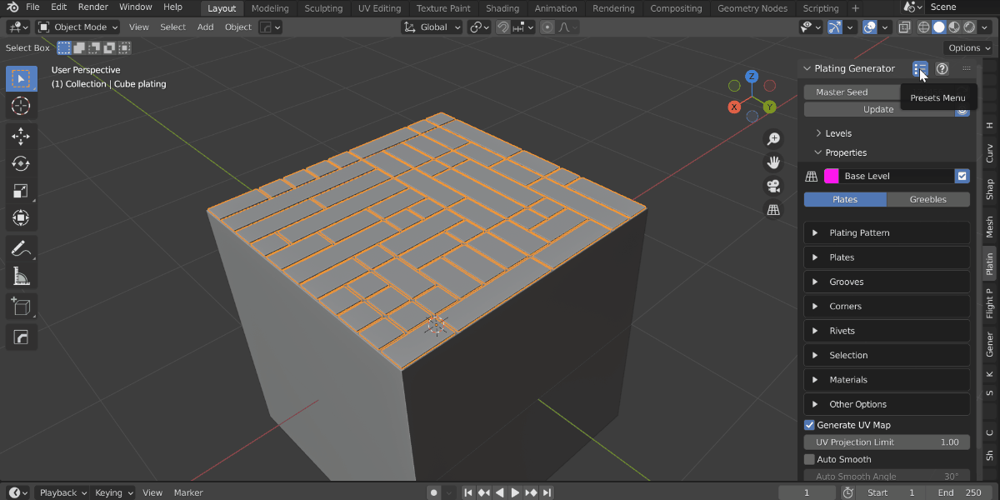
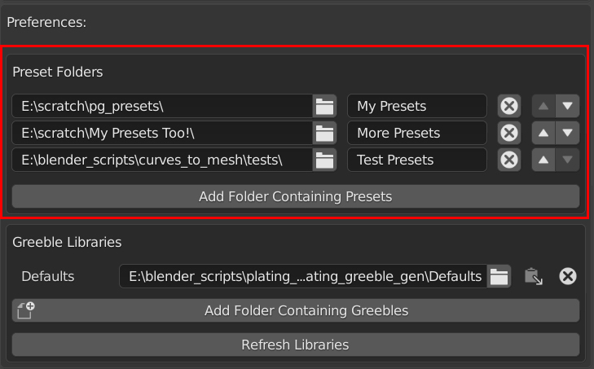

###############
Presets
###############

  An example of using presets to automatically apply a variety of effects to build on.

You can save your own effects that you can then re-use or share.

The add-on comes bundled with some pre-configured presets, and you can also create your own.

Each workflow contains its own separate set of presets.

***************************************************
:ref:`Non Destructive Workflow` Presets
***************************************************

Save a Preset
============================

#. With the *plating* object selected, in the top right of the *Plating Generator* panel is the presets sub-menu. Select *"Save Preset"*:

    .. image:: ../images/preset_save.jpg
        :alt: Save a preset menu option.

#. In the *File Menu* window that appears, type the name of the *.json* file you wish to save as a preset.  You may wish to save in a :ref:`pre-configured directory<Custom presets directory>` for easy access later:

    .. figure:: ../images/preset_save_dialog.jpg
        :alt: Saving a preset

#. Click "Save".

Your settings will be then saved as a *.json file* you can :ref:`load <Load a Preset>` later or access via a sub menu if you have saved it to your :ref:`presets directory<Custom presets directory>`.

Load a Preset
============================

#. With a *plating* object selected, in the top right of the *Plating Generator* panel, go to the the presets sub-menu and select *"Load Preset"*:

    .. image:: ../images/preset_load.jpg
        :alt: Save a preset menu option.

#. In the *File Menu* that appears, select the *.json* file of the preset you wish to load:

    .. image:: ../images/presets_load_dialog.jpg
        :alt: Save a preset menu option.

#. Click "Load".

This will update the selected *Plating* object's settings with the preset.

Quickly apply a Preset
============================

A pre-bundled preset, or a preset file in your :ref:`presets directory<Custom presets directory>`, can be quickly added in two ways:

#. **Create an object with the preset instantly applied** via the right-click menu, under *Plating Generator -> Add Preset*:

    .. image:: ../images/preset_add.jpg
        :alt: Adding a preset from the Plating Generator's add menu.

#. **Change an existing object to use a preset** through the top menu in the side panel:

    .. image:: ../images/preset_apply.jpg
        :alt: Applying a preset to an existing plating object via the panel.

Custom presets directory
---------------------------------------

.. figure:: ../images/preset_menu_eg.jpg
  :alt: Preset Menus example

Placing your *json* file presets in a pre-configured directory gives you quick access via the drop down menus.

This directory can be set in the *Presets Path* setting under the *Edit - Preferences - Addons* menu under the Plating Generator add-on entry:

***************************************************
:ref:`Destructive Workflow` Presets
***************************************************

Add Preset
============================

Press the **+** button at the top of the pop-up menu, enter a name for the preset and click 'OK'.

  Adding a Preset

Delete Preset
============================

With the Preset loaded, click the **-** button next to the preset dropdown.

.. figure:: ../images/preset_d_del.jpg
  :alt: Deleting a preset

  Deleting a Preset

Apply Preset
============================

With a Plating Object selected, click the name of the entry in the Presets menu:

  Applying a Preset